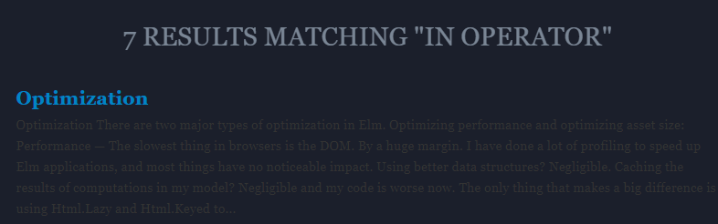

# Initial thoughts for improvement
_and Elm notes in general_

TOC
1. [Day 1](#Day-1)
1. [Day 2](#Day-2)
1. [Day 3](#Day-3)
1. [Day 4](#Day-4)
1. [dead code elimination](#dead-code-elimination)
1. [backend](#backend)

## Day 1
1. asset size - `elm make --optimize` optimize variable names but **does not:**
    1. eliminate dead code (in the simple examples dead code is 56.9%)
    2. reduce the boilarplate code at all
    3. there is no way to reduce boilarplate code from initial `elm.json` - everything is required
2. vscode `elm.json` schema is missing and version information is not fetched from registry (https://package.elm-lang.org/all-packages)
    1. Is there any way to get version information for a single package?
3. lots of links are not correct - mainly pointing to https://github.com/elm-lang/ instead of https://github.com/elm/
    1. ... start writing down URLs...
4. `elm` CLI does not have tab completion for commands or flags
5. To find the bootstrap code for js code (to seperate js from HTML), I had to do
`elm make --output textFields.js src/Main.elm && elm make src/Main.elm && diff index.html textFields.js` and then found:
```js
try {
	var app = Elm.Main.init({ node: document.getElementById("elm") });
}
catch (e) {
	// display initialization errors (e.g. bad flags, infinite recursion)
	var header = document.createElement("h1");
	header.style.fontFamily = "monospace";
	header.innerText = "Initialization Error";

	var pre = document.getElementById("elm");
	document.body.insertBefore(header, pre);
	pre.innerText = e;

	throw e;
}
```
6. [summarize.sh](https://gist.github.com/evancz/fc6ff4995395a1643155593a182e2de7) does not work for Elm 0.19.1
    1. I hacked some small changes into [this one](./summarize.sh) and that works on my system (Windows WSL Ubuntu).
7. First issue - how to type cast - solution: https://stackoverflow.com/questions/45621072/how-can-i-transform-an-int-into-html
Wondering while doing the exercise in https://guide.elm-lang.org/architecture/text_fields.html
8. Confused about how indentation matters, especially in the view code...
9. [The online code editor](https://elm-lang.org/examples/forms) is missing `module Main exposing (..)`. I need to copy it from
previous examples or *forms/src/Main.elm* won't compile. The same for [text-fields](https://elm-lang.org/examples/text-fields)
10. Wondering what `toMsg` is in *forms/src/Main.elm* and why a `Variant` is used as argument? e.i. `Name`.
`(String -> msg)` must be `onInput`. Only the first 3 arguments are explained in https://guide.elm-lang.org/architecture/forms.html
11. [The Elm Plugin](https://discourse.elm-lang.org/t/elm-plugin-for-visual-studio-code-0-10-0-and-new-language-server/5399) is a
joy, but it does not work for *forms/src/Main.elm* hmm :sad: - restart vscode!
12. I really miss a debugger - why oh why won't [9d3bc3e](https://github.com/dotnetCarpenter/elmtut/blob/9d3bc3e751a97675c046b9442de05d2e2839006b/forms/src/Main.elm) work!?? How do I `Debug.log` a Bool value?
13. I really can not get lambda function to work with `.filter` and `.map`. And the compiler is not giving me any clues, so I have created an issue: https://github.com/elm/error-message-catalog/issues/336


## Day 2

1. How does reactivity work? Created *why/src/Main.elm* to understand.
2. What is lower case types? E.i. `(String -> msg) -> Html msg`. Hint:
This `text` call produces: `Html msg`.
```
type alias Html msg = VirtualDom.Node msg
The core building block used to build up HTML. Here we create an Html value with no attributes and one child:

hello : Html msg
hello =
  div [] [ text "Hello!" ]
```
3. The interactive editor in the [Guide](https://guide.elm-lang.org/types/reading_types.html) is indispensable. It would be even more awesome if it allowed copy/paste.
4. Normal anchor (hash) links does not work in the Guide. While headings do have IDs, the following
https://guide.elm-lang.org/types/reading_types.html#type-annotations does not scroll to
`<h2 id="type-annotations">Type Annotations</h2>`. I think it is because Elm apps are dynamic
rendered and the browser can not scroll to an element that does not exist yet. A `scrollTo` function might be considered...
5. *“You said argument powerLevel was an Int, but it is getting used as a String!”* is not the best example when the
code example is:
```elm
checkPower : Int -> String
checkPower powerLevel =
  if powerLevel > 9000 then "It's over 9000!!!" else "Meh"

-- checkPower True -- error!
```
6. *What is lower case types?* is explained in the Type Variables section - nice!


## Day 3

1. Exercise 1 in https://guide.elm-lang.org/error_handling/maybe.html is missing `module Main exposing (..)`
and won't compile. Similar to 9. on Day 1. Is this new in 0.19?

## Day 4

1. In the _maybe.html_ excersise , when hovering over `celsius` in `Just celsius`,
`elm-format@0.8.3` tells me that `celsius` is a `Local parameter`. AFAIK it is a,
`Local Float parameter` (`String.toFloat model.input`). Is `elm-format` missing type information,
is there some locked potential here? Could intelliSense give me better options for that variable?
But at least the compiler knows and will throw if I use `celsius` wrong.
2. Wow, the search result text is really difficult to read: 
3. Why is `Attribute` always imported and `elm-format` always saying it
is unused? Should I use it more?
4. Understand now that `elm reactor`, while it compiles `Main.elm` it does **not** generate a new `index.html`. For that
use `elm make src/Main.elm`.
5. Custon code folding support in `elm-format` would be nice. Ala https://marketplace.visualstudio.com/items?itemName=maptz.regionfolder


----------------------------------------------------------

## dead code elimination

There is an article that suggest that [Elm does dead code elimination](https://elm-lang.org/news/small-assets-without-the-headache)
but then why does the *buttons/* app have the following unused functions and objects?
(only listing the first 15 here - there is a lot more)

```js
var _Utils_notEqual = F2(function(a, b) { return !_Utils_eq(a,b); });
var _Utils_ge = F2(function(a, b) { return _Utils_cmp(a, b) >= 0; });
var _Utils_compare = F2(function(x, y)
var _Utils_Tuple0_UNUSED = { $: '#0' };
function _Utils_Tuple2_UNUSED(a, b) { return { $: '#2', a: a, b: b }; }
function _Utils_Tuple3(a, b, c) { return { a: a, b: b, c: c }; }
function _Utils_Tuple3_UNUSED(a, b, c) { return { $: '#3', a: a, b: b, c: c }; }
function _Utils_chr_UNUSED(c) { return new String(c); }
function _Utils_update(oldRecord, updatedFields)
var _List_Nil_UNUSED = { $: '[]' };
function _List_Cons_UNUSED(hd, tl) { return { $: '::', a: hd, b: tl }; }
function _Debug_todo(moduleName, region)
function _Debug_todoCase(moduleName, region, value)
function _Debug_toString_UNUSED(value)
function _Debug_crash_UNUSED(identifier, fact1, fact2, fact3, fact4)
```
https://github.com/dotnetCarpenter/elmtut/issues/1 does a pretty good job at
explaining what is going on and how to get rid of dead code (`terser`).
Also [this article](https://medium.com/better-programming/reducing-js-bundle-size-a6533c183296) sheds some light on the DCE process using `terser`.

## backend

Seems that the `elm reactor` server is written in Haskell https://github.com/elm/compiler/tree/master/builder/src
